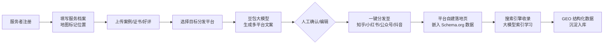
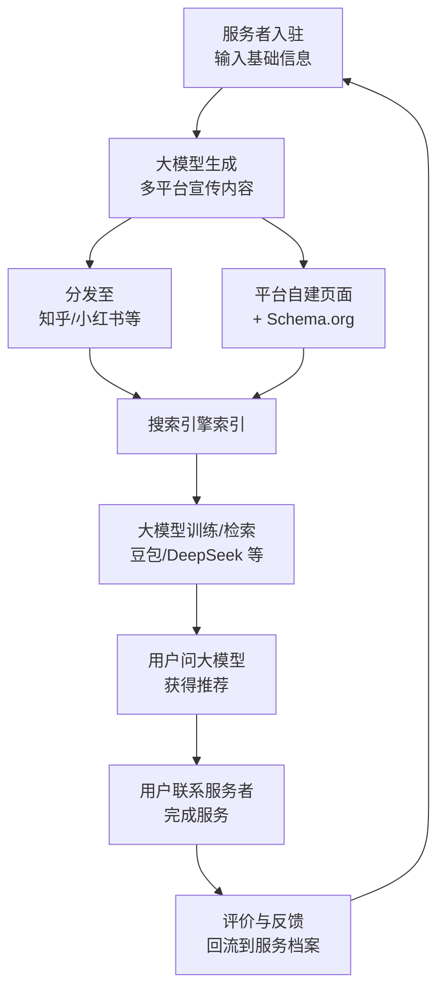
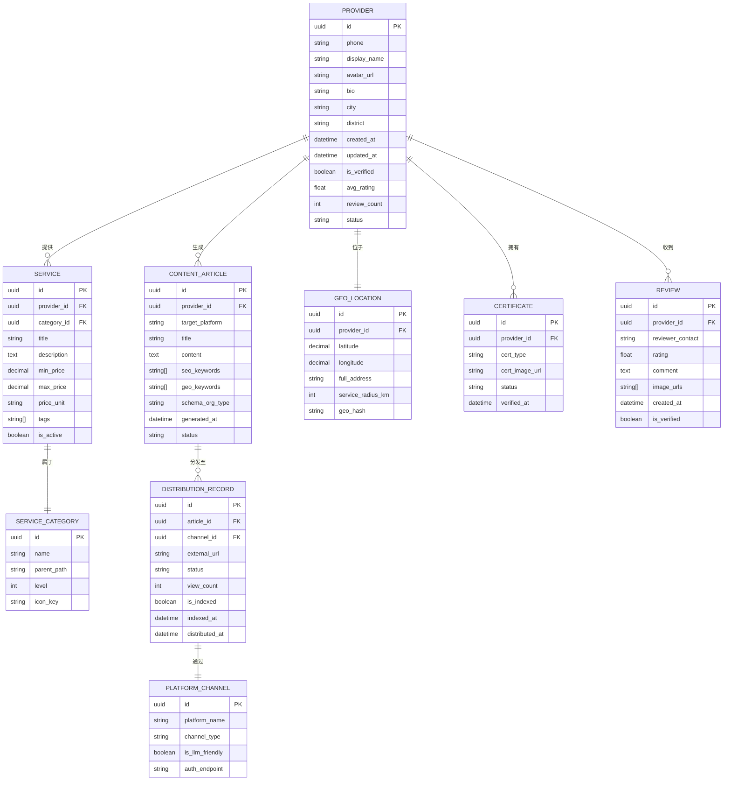
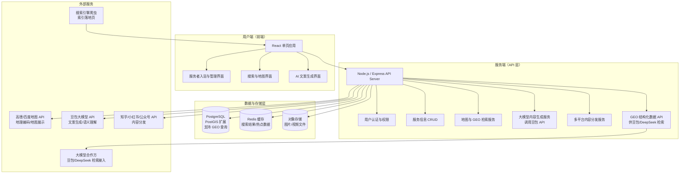
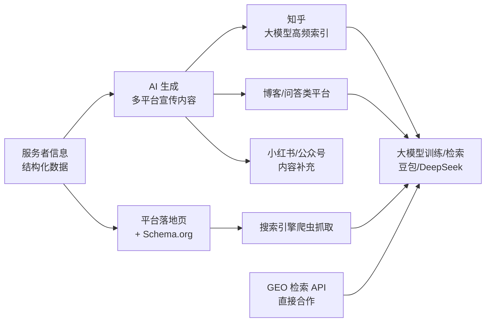

# 产品需求文档（PRD）：全民 GEO 服务平台

> 文档版本：v1.0  
> 撰写日期：2026-06-17  
> 文档状态：初稿 · 待评审

---

## 1. 产品概述

### 1.1 项目背景与核心洞察

**一句话定义**：一款面向中小企业、自由职业者及普通技能个体的 **GEO（地理位置）服务信息枢纽**，帮助零门槛入驻者将服务信息生成多平台内容并分发，使其被豆包、DeepSeek 等大模型检索并学习，最终实现"用户向大模型提问 → 大模型推荐周边服务者"的下一代本地服务匹配模式。

**为什么现在做**：

1. **大模型正在成为新的"搜索引擎入口"**：越来越多用户习惯向豆包、DeepSeek、通义千问等大模型直接提问"附近有什么靠谱的 XX"，而非打开传统地图或分类信息平台。但大量蓝领技工、小商户的服务信息尚未进入大模型的知识体系。

2. **LLMO（大模型优化）是新的 SEO**：过去个体服务者需要做 SEO（搜索引擎优化）让百度/高德搜到自己；未来他们需要做 **LLMO（大模型优化）** 让豆包/DeepSeek 能"知道"并推荐自己。目前没有面向普通个体的零门槛 LLMO 工具。

3. **本地服务供需错配仍然严重**：一面是"手艺人缺单、个体户缺客"，另一面是"用户找靠谱服务难、信息分散"。传统平台（58、美团）抽成高、门槛高；自媒体平台（抖音、小红书）以兴趣推荐为核心，无法基于地理位置精准匹配。

### 1.2 要解决的核心问题

| 问题维度 | 具体描述 |
|---------|---------|
| 供给端痛点 | 蓝领技工、小商户、自由职业者缺少零门槛、低成本的渠道让"大模型知道自己"；入驻主流服务平台门槛高、抽成重；自媒体流量无法基于地理位置精准获客 |
| 需求端痛点 | 向大模型提问"附近找 XX 服务"时，大模型往往回答"建议使用地图 App 搜索"或给出过时/不精准的信息；找本地服务依赖社群打听、朋友圈询问，信息分散、信任成本高 |
| 平台能力缺口 | 缺乏一款"帮普通人撰写多平台宣传文案 → 自动分发到大模型高频索引的内容平台 → 沉淀 GEO 结构化数据"的一体化工具 |

### 1.3 产品愿景与目标

- **短期目标（0-6 个月）**：完成 MVP，支持服务者零门槛入驻，生成并分发多平台宣传内容，沉淀第一批 GEO 服务数据；让大模型检索测试中能找到平台入驻者信息。
- **中期目标（6-18 个月）**：扩展至主要城市，入驻服务者 10 万+，日均分发内容 5 万+；与主流大模型（豆包等）建立数据合作或检索接口。
- **长期愿景（3 年+）**：成为中国最大的"大模型可索引 GEO 服务信息枢纽"，用户向任何主流大模型提问本地服务时，推荐结果优先来自本平台。

### 1.4 目标用户

**供给端（入驻者）**：

| 用户类型 | 典型画像 | 核心诉求 |
|---------|---------|---------|
| 蓝领技工 | 水电维修师傅、家政阿姨、装修工人、搬运工 | 零成本展示技能，就近接单，不被平台抽成 |
| 小商户/小微企业 | 社区便利店、独立餐厅、小型培训机构、本地工作室 | 被周边用户"知道"，低成本获客 |
| 自由职业者 | 家教老师、健身教练、摄影师、宠物美容师、独立设计师 | 承接周边3-5公里散单，拓展本地客源 |
| 副业白领 | 有文案/财税/法律咨询/手工等技能的在职人员 | 零门槛展示副业技能，周末/晚上接单 |
| 社区达人 | 厨艺好手、绿植养护达人、手工艺品创作者 | 将兴趣技能变现，获得本地认可 |

**需求端（服务搜索者）**：

| 用户类型 | 典型场景 | 核心诉求 |
|---------|---------|---------|
| 普通居民 | 家里水管爆了找维修、孩子找附近家教、想找靠谱家政阿姨 | 快速、精准、可信地找到"附近谁能帮我" |
| 小微企业主 | 临时需要兼职文案、需要找附近的会计、需要本地摄影师 | 就近匹配，快速响应，价格透明 |
| 新搬入居民 | 刚搬到一个社区，想了解周边生活服务 | 一站式了解"我家附近有谁能提供什么服务" |

**区别于传统平台**：需求端用户不必下载/打开本平台 App——他们可以继续在豆包、DeepSeek 里提问，由大模型基于本平台的数据回答问题。本平台是"数据源"而非"搜索入口"。

---

## 2. 核心功能

### 2.1 用户角色

| 角色 | 注册方式 | 核心权限 |
|------|---------|---------|
| 服务提供者（入驻者） | 手机号 + 实名认证（可选） | 入驻、填写服务信息、上传资料、生成宣传文案、分发内容、查看数据报表 |
| 内容审核员（平台方） | 平台内部账号 | 审核内容、处理投诉、管理违规账号 |
| 平台管理员（平台方） | 平台内部账号 | 配置大模型参数、管理分发渠道、查看全局数据 |
| 数据消费者（大模型/第三方） | API 接入授权 | 结构化检索 GEO 服务数据（需授权） |

### 2.2 功能模块总览

```
┌─────────────────────────────────────────────────────────────────────┐
│                        全民 GEO 服务平台                              │
├─────────────────────────────────────────────────────────────────────┤
│                                                                     │
│  A. 服务者入驻与信息管理模块                                           │
│  ├── A1 零门槛入驻（手机号注册 + 基础资料填写）                         │
│  ├── A2 服务档案创建（技能标签/服务内容/价格/地理位置/案例图）           │
│  ├── A3 资料上传中心（图文/短视频/证书/客户评价截图）                   │
│  └── A4 信息编辑与维护（随时更新服务状态、价格、可接单区域）              │
│                                                                     │
│  B. 大模型内容生成模块                                               │
│  ├── B1 智能文案撰写（基于服务档案，自动生成多平台风格的宣传文案）         │
│  ├── B2 多平台内容适配（小红书风格/知乎问答/微信公众号文章/抖音脚本/头条）│
│  ├── B3 关键词与 GEO 标签注入（自动加入城市/商圈/地标/服务类别关键词）    │
│  └── B4 内容预览与人工编辑（AI 生成初稿 → 人工微调 → 确认发布）           │
│                                                                     │
│  C. 多平台内容分发模块                                               │
│  ├── C1 自媒体平台一键分发（知乎/小红书/微信公众号/头条号/抖音）          │
│  ├── C2 "大模型友好"平台优先分发（知乎/博客/技术文档站等大模型高频索引源）│
│  ├── C3 分发状态与效果追踪（是否发布成功/是否被搜索引擎收录/阅读量）       │
│  └── C4 平台自有内容页 SEO 优化（独立落地页 + Schema.org 结构化数据）    │
│                                                                     │
│  D. GEO 结构化数据沉淀模块                                           │
│  ├── D1 服务信息结构化存储（位置/类别/价格/评分/营业时间/联系方式）       │
│  ├── D2 大模型检索接口（标准化 API，供豆包/DeepSeek 等检索）            │
│  ├── D3 数据新鲜度维护（自动提醒更新、标记过期信息）                    │
│  └── D4 区域服务数字资产（按城市/商圈维度的服务生态数据看板）             │
│                                                                     │
│  E. 平台内搜索与匹配模块                                             │
│  ├── E1 自然语言检索（用户用口语描述需求 → 大模型理解 → 匹配周边服务者）   │
│  ├── E2 地图可视化展示（服务者在地图上按类别/距离/评分展示）              │
│  ├── E3 服务者详情页（完整信息 + 真实评价 + 联系方式）                  │
│  └── E4 联系与撮合（站内信/电话/微信跳转，不介入交易抽成）               │
│                                                                     │
│  F. 口碑与信任体系模块                                               │
│  ├── F1 服务评价系统（完成服务后的评分与文字评价）                      │
│  ├── F2 认证体系（实名认证/技能认证/平台推荐徽章）                      │
│  ├── F3 投诉与处理（违规行为举报 + 平台介入仲裁）                       │
│  └── F4 评价真实性验证（多维度防刷 + 关联真实交易标记）                  │
│                                                                     │
└─────────────────────────────────────────────────────────────────────┘
```

### 2.3 页面与功能详细说明

| 页面名称 | 所属模块 | 核心功能描述 |
|---------|---------|---------|
| **Landing / 首页** | A | 展示产品价值主张、入驻入口、搜索入口、热门服务者推荐 |
| **入驻注册页** | A1 | 手机号验证码注册、基础资料引导填写（姓名/所在城市/技能类别） |
| **服务档案创建页** | A2 | 地理位置选择（地图选点）、服务类别选择、服务描述填写、价格区间设置、案例图片上传 |
| **资料上传中心** | A3 | 图文/短视频批量上传、证书照片上传、客户好评截图管理 |
| **智能文案生成页** | B | 选择目标平台（小红书/知乎/公众号/抖音/头条）→ AI 自动生成文案 → 人工编辑确认 → 加入 GEO 关键词 |
| **内容分发仪表盘** | C | 已绑定平台列表、一键分发按钮、分发状态追踪、收录状态提示、阅读/互动数据展示 |
| **服务者主页（公开展示页）** | D/E | 服务者完整信息展示、服务内容、价格、评价、地图位置、联系方式；Schema.org 结构化数据嵌入 |
| **搜索结果页（地图 + 列表）** | E | 地图上服务者热力分布、列表按距离/评分排序、筛选条件（类别/价格/认证状态） |
| **服务者管理后台** | A/B/C/D/F | 信息维护、内容生成历史、分发数据看板、评价管理、认证状态 |
| **平台管理后台** | 系统 | 内容审核、投诉处理、大模型 API 配置、数据看板、账号管理 |
| **大模型检索 API 文档页** | D2 | API 接入说明、示例请求/响应、申请接入入口（面向豆包/DeepSeek 等合作方） |

### 2.4 模块详细设计

#### 模块 A：服务者入驻与信息管理

**核心设计原则**：零门槛、引导式、5 分钟内可完成首次入驻。

| 功能点 | 详细说明 |
|-------|---------|
| 入驻流程 | 1. 手机号验证码登录 → 2. 引导选择"我能提供什么服务"（多选）→ 3. 地图选点标记"服务范围" → 4. 填写服务描述与价格 → 5. 上传至少1张案例图 → 完成 |
| 地理位置采集 | 支持"地图拖拽选点 + 手动输入地址"双模式；自动解析城市/区/商圈；可选服务半径（1公里/3公里/5公里/全城） |
| 服务标签体系 | 预设一级分类（家政维修/教育培训/生活服务/创意设计/财税法律/运动健身/其他）+ 二级分类 + 自定义标签 |
| 资料管理 | 图片支持最多20张，短视频支持最多5条（≤60秒）；支持证书上传（用于后续技能认证） |
| 信息新鲜度 | 超过 90 天未更新的信息自动标记为"可能过时"，提醒服务者确认 |

#### 模块 B：大模型内容生成

**核心设计原则**：AI 出 80%，人改 20%；内容必须"大模型可读"。

| 功能点 | 详细说明 |
|-------|---------|
| 文案生成引擎 | 基于豆包大模型 API，输入：服务档案内容 + 目标平台 + 风格偏好；输出：完整宣传文案初稿 |
| 多平台风格适配 | 小红书：标题党 + emoji + 短句 + 标签；知乎：问题+详细解答 + 专业语气；微信公众号：长篇深度文；抖音：口播脚本 + 分镜提示；头条号：资讯/攻略风格 |
| GEO 关键词注入 | 自动在文案中注入：城市名 + 商圈名 + 地标 + 服务类别关键词（如"北京朝阳区三里屯附近的水电维修"），提升大模型检索命中率 |
| Schema.org 结构化建议 | 为服务者主页生成 LocalBusiness/Service 结构化数据，提升搜索引擎与大模型理解度 |
| 内容人工编辑 | AI 生成后提供富文本编辑器，支持服务者自行修改、调整语气、增减内容 |

#### 模块 C：多平台内容分发

**核心设计原则**：优先分发到大模型"最爱索引"的平台。

| 功能点 | 详细说明 |
|-------|---------|
| 平台接入优先级 | 第一梯队（大模型高频索引源）：知乎、博客类平台、自建内容页；第二梯队（流量平台）：小红书、微信公众号、头条号；第三梯队（视频平台）：抖音 |
| 一键分发机制 | 服务者授权绑定各平台账号后，点击"全部分发"即可将同一主题的内容适配为各平台风格并发布 |
| 分发状态追踪 | 显示每个平台的发布状态（成功/失败/审核中）、发布时间、链接 |
| 收录与索引检测 | 定期检测内容是否被搜索引擎收录、是否出现在大模型的检索测试结果中 |
| 平台自有落地页 SEO | 每个服务者在本平台有独立 URL，页面嵌入 Schema.org 结构化数据、Open Graph 标签，支持搜索引擎与大模型爬虫 |

#### 模块 D：GEO 结构化数据沉淀

**核心设计原则**：数据是产品的长期护城河；必须结构化、标准化、可检索。

| 功能点 | 详细说明 |
|-------|---------|
| 数据模型 | 见第5章详细数据模型 |
| 大模型检索 API | 提供标准化 REST API，支持按"地理位置半径 + 服务类别 + 关键词 + 评分阈值"检索；返回 JSON 格式结构化数据，供豆包/DeepSeek 等接入使用 |
| 数据质量维护 | 自动检测并标记可能过时的信息；支持用户举报虚假信息；人工审核重要数据 |
| 区域数据看板 | 按城市/商圈维度展示服务生态：服务者数量分布、热门服务类别、供需缺口（搜索量 vs 供给量） |

#### 模块 E：平台内搜索与匹配

**核心设计原则**：平台内搜索是"备选入口"，核心入口仍在大模型侧。

| 功能点 | 详细说明 |
|-------|---------|
| 自然语言检索 | 用户输入"我家在望京，水管漏水了，找个靠谱师傅"→ 大模型解析 → 提取"望京"位置 + "水管维修"类别 → 返回周边匹配服务者 |
| 地图 + 列表双视图 | 左侧地图展示服务者位置与评分，右侧列表展示详细信息；支持按距离/评分/价格排序 |
| 服务者详情页 | 完整信息展示：服务描述、价格、案例图、评价、地图位置、联系方式；Schema.org 结构化数据嵌入（供爬虫抓取） |
| 联系渠道 | 站内信/电话拨打/复制微信号；平台不介入交易、不收取抽成 |

#### 模块 F：口碑与信任体系

| 功能点 | 详细说明 |
|-------|---------|
| 服务评价 | 完成服务后，服务者可邀请用户扫码评价；评价内容同步展示在服务者主页 |
| 认证体系 | 实名认证（身份证+人脸）、技能认证（上传证书/作品审核）、平台推荐徽章（高评分+多好评） |
| 投诉处理 | 用户可举报虚假信息/不实评价；平台人工介入；违规账号封禁 |
| 评价真实性 | 关联联系方式验证、时间戳校验、反刷分算法、人工抽查 |

---

## 3. 核心业务流程

### 3.1 服务者入驻与内容分发流程



### 3.2 用户通过大模型获取服务流程

```mermaid
flowchart LR
    A[用户向豆包提问：<br/>"北京朝阳门附近<br/>有靠谱的家政阿姨吗"] --> B[豆包调用<br/>本平台 GEO 检索 API]
    B --> C[平台检索：<br/>朝阳门 + 家政 + 评分≥4.5]
    C --> D[返回结构化结果：<br/>3-5 位匹配服务者信息]
    D --> E[豆包整理为<br/>自然语言回答]
    E --> F[用户获取服务者<br/>名称/位置/联系方式]
    F --> G[用户联系服务者<br/>完成服务]
    G --> H[服务者邀请用户<br/>扫码评价]
    H --> I[评价数据回流<br/>强化服务者可信度]
```

### 3.3 数据流转与闭环



---

## 4. 用户界面设计

### 4.1 设计风格

| 设计维度 | 具体说明 |
|---------|---------|
| **设计理念** | 简洁、可信、温暖——体现"邻里相助"的社区感，同时传递"信息真实可靠"的专业感 |
| **主色调** | 主色：温暖橙（#FF7A45）— 代表活力、社区、普通人；辅助色：深蓝（#2B4C7E）— 代表可信、专业、大模型；中性色：灰白系列 |
| **按钮风格** | 圆角按钮（border-radius: 10px），微阴影，hover 状态有轻微放大与颜色加深；主要 CTA 使用主色填充 |
| **字体** | 中文使用"思源黑体"或"苹方"；标题字号 24-32px，正文 14-16px，辅助文字 12px；行高 1.6-1.8 |
| **布局风格** | 卡片式布局为主，顶部导航栏 + 内容区 + 底部信息栏；地图页面采用"左地图右列表"双栏布局 |
| **图标风格** | 使用线性图标（如 Lucide Icons 风格），简洁清晰；避免过于卡通或过于商务 |
| **动画** | 页面切换柔和过渡（300ms）；卡片 hover 有微阴影加深；加载状态使用骨架屏 |

### 4.2 页面设计概览

| 页面名称 | 关键模块 | UI 元素要点 |
|---------|---------|------------|
| **Landing 页** | Hero 区域 + 价值主张 + 入驻 CTA + 搜索框 + 服务者展示 | 大标题强调"让豆包也能推荐你"；搜索框支持自然语言输入；展示3-5位精选服务者卡片 |
| **入驻注册页** | 分步引导表单 | 步骤指示器（1/5 → 2/5 → ...）；每步极简字段；地图选点组件居中展示 |
| **服务档案页** | 信息编辑卡片 + 地图选点 | 左侧表单编辑，右侧地图实时预览位置；支持拖拽地图标记 |
| **智能文案生成页** | 平台选择器 + AI 生成预览区 + 人工编辑区 | 平台卡片可多选（小红书/知乎/公众号等），每个有独立风格预览；生成过程有加载动画；生成后提供富文本编辑 |
| **分发仪表盘** | 平台绑定状态 + 内容列表 + 数据概览 | 每个平台显示：绑定状态/已发布内容数/阅读量/收录状态 |
| **搜索结果页** | 地图组件 + 服务者列表 + 筛选器 | 地图上服务者用不同颜色图标区分类别；列表卡片含距离/评分/价格；支持类别/距离/价格筛选 |
| **服务者主页** | 信息展示 + 案例图集 + 评价区 + 地图定位 + 联系按钮 | Schema.org 结构化数据嵌入页面（不可见但对爬虫可见）；评价区按时间倒序展示 |
| **管理后台** | 数据看板 + 快捷操作区 | 仪表盘展示：内容分发数/被收录数/被检索次数/评价数/评分趋势 |

### 4.3 响应式设计

| 设备类型 | 设计策略 | 关键调整 |
|---------|---------|---------|
| **桌面端（≥1024px）** | 主力设计基准 | 完整双栏布局；地图占屏幕左60%，列表占右40% |
| **平板端（768-1023px）** | 自适应压缩 | 双栏改为上下堆叠；地图缩小为可展开全屏模式 |
| **移动端（<768px）** | 触摸优化 | 单一列纵向滚动；按钮加大（min-height 44px）；地图默认全屏，可切换列表视图；表单字段垂直排列 |

### 4.4 关键页面示意图（文字描述）

**Landing 页**：

```
┌─────────────────────────────────────────────────────────────────┐
│  LOGO [全民GEO]         入驻入口    搜索服务     登录           │
├─────────────────────────────────────────────────────────────────┤
│                                                                 │
│           让豆包也能推荐你的服务                                  │
│      零门槛入驻 · AI 生成多平台宣传 · 大模型可索引                 │
│                                                                 │
│  ┌─────────────────────────────────────────────────────────┐   │
│  │  描述你的需求，如："望京附近找靠谱的水电维修师傅"  [搜索]│   │
│  └─────────────────────────────────────────────────────────┘   │
│                                                                 │
│  [立即入驻 · 免费]   [了解如何被大模型推荐]                       │
│                                                                 │
├─────────────────────────────────────────────────────────────────┤
│                                                                 │
│  他们已经在被豆包推荐                                            │
│  ┌─────────┐ ┌─────────┐ ┌─────────┐ ┌─────────┐ ┌─────────┐   │
│  │张师傅   │ │李阿姨   │ │王老师   │ │陈设计师 │ │刘摄影师 │   │
│  │水电维修 │ │家政保洁 │ │家教辅导 │ │品牌设计 │ │人像摄影 │   │
│  │⭐4.9    │ │⭐4.8    │ │⭐5.0    │ │⭐4.7    │ │⭐4.9    │   │
│  │朝阳区   │ │海淀区   │ │西城区   │ │朝阳区   │ │东城区   │   │
│  └─────────┘ └─────────┘ └─────────┘ └─────────┘ └─────────┘   │
│                                                                 │
├─────────────────────────────────────────────────────────────────┤
│  为什么选择我们？                                                │
│  • 零门槛入驻，不抽成                                            │
│  • AI 帮你写知乎/小红书/公众号文案，一键分发                     │
│  • 让豆包、DeepSeek 等大模型也能"知道"你                         │
│  • 基于真实位置，精准匹配周边需求                                │
│                                                                 │
└─────────────────────────────────────────────────────────────────┘
```

**智能文案生成页**：

```
┌─────────────────────────────────────────────────────────────────┐
│  ← 返回         生成宣传文案                                     │
├─────────────────────────────────────────────────────────────────┤
│                                                                 │
│  第一步：选择要分发的平台                                          │
│  ┌─────────┐ ┌─────────┐ ┌─────────┐ ┌─────────┐ ┌─────────┐   │
│  │☑ 知乎   │ │☑ 小红书 │ │☑ 公众号 │ │☑ 头条号 │ │☑ 抖音  │   │
│  └─────────┘ └─────────┘ └─────────┘ └─────────┘ └─────────┘   │
│                                                                 │
│  第二步：AI 正在生成... [▓▓▓▓▓▓▓░░░ 70%]                       │
│                                                                 │
│  第三步：预览与编辑                                               │
│  ┌─────────────────────────────────────────────────────────┐   │
│  │📕 知乎风格                                               │   │
│  │  标题："作为一个在朝阳做了8年的水电师傅，我想告诉你..." │   │
│  │  正文：...                                               │   │
│  │  [编辑] [重新生成]                                       │   │
│  └─────────────────────────────────────────────────────────┘   │
│                                                                 │
│  ┌─────────────────────────────────────────────────────────┐   │
│  │📕 小红书风格                                             │   │
│  │  标题："💡朝阳宝藏师傅！家里水管爆了找他就对了✅"       │   │
│  │  正文：姐妹们...                                         │   │
│  │  #北京家政 #水电维修 #朝阳上门服务                       │   │
│  │  [编辑] [重新生成]                                       │   │
│  └─────────────────────────────────────────────────────────┘   │
│                                                                 │
│                              [确认并一键分发]                    │
│                                                                 │
└─────────────────────────────────────────────────────────────────┘
```

---

## 5. 数据模型与技术架构

### 5.1 核心数据模型（ER 图）



### 5.2 关键数据说明

| 数据实体 | 核心字段 | 设计要点 |
|---------|---------|---------|
| PROVIDER（服务者） | id/手机号/昵称/头像/简介/城市/评分/认证状态 | 手机号为唯一标识；评分动态计算；90天未更新标记为"可能过时" |
| GEO_LOCATION（地理位置） | provider_id/经纬度/完整地址/服务半径/GeoHash | GeoHash 索引支持按区域快速检索；支持多边形服务范围（后续） |
| SERVICE（服务项） | provider_id/分类ID/标题/描述/价格区间/标签/是否激活 | 一个服务者可提供多项服务；价格区间而非固定值，适应议价场景 |
| SERVICE_CATEGORY（服务分类） | 名称/父级路径/层级/图标Key | 两级分类结构；支持自定义标签补充 |
| CONTENT_ARTICLE（AI生成内容） | provider_id/目标平台/标题/正文/SEO关键词/GEO关键词/Schema.org类型 | GEO关键词自动注入城市/商圈/地标；Schema.org 类型用于落地页结构化数据 |
| DISTRIBUTION_RECORD（分发记录） | article_id/渠道ID/外部URL/状态/阅读量/是否被收录 | 追踪每篇内容在每个平台的发布状态和被搜索引擎/大模型索引的情况 |
| PLATFORM_CHANNEL（分发渠道） | 平台名/渠道类型/是否大模型友好/鉴权端点 | "大模型友好度"字段用于排序分发优先级 |
| REVIEW（评价） | provider_id/评分/评论/图片/是否验证 | 支持"扫码评价"关联真实服务；评分用于计算服务者综合得分 |

### 5.3 技术架构方案



### 5.4 技术选型

| 层级 | 技术选型 | 选型理由 |
|-----|---------|---------|
| **前端** | React 18 + TypeScript + Vite | 组件化开发效率高；TypeScript 保证类型安全；Vite 构建快 |
| **前端样式** | Tailwind CSS 3 | 快速开发、一致性好、体积可控 |
| **地图组件** | 高德地图 JS API 或 百度地图 | 国内地理数据精准；支持地图选点、距离计算、行政区划分 |
| **状态管理** | Zustand（轻量）或 React Query | 服务端状态用 React Query 管理；本地状态用 Zustand |
| **后端** | Node.js + Express 4 | 与前端共用语言，开发效率高；生态成熟 |
| **数据库** | PostgreSQL + PostGIS 扩展 | PostGIS 原生支持地理空间查询（按半径/多边形检索服务者） |
| **缓存** | Redis | 缓存高频搜索结果、热点服务者数据 |
| **对象存储** | 阿里云 OSS / 腾讯云 COS | 存储图片、短视频、证书文件 |
| **大模型 API** | 豆包（Volcengine） | 国内模型、中文理解好、响应快；后续可扩展 DeepSeek/通义千问 |
| **内容分发** | 各平台开放 API + 自建页面 | 知乎/小红书/公众号 API 接入；自建页面做 SEO 保底 |
| **部署** | 国内云厂商（阿里云/腾讯云） | 域名备案合规；CDN 加速内容分发 |

### 5.5 API 路由定义

| 路由 | 方法 | 用途 |
|-----|------|-----|
| `/api/auth/register` | POST | 服务者注册（手机号验证码） |
| `/api/auth/login` | POST | 登录 |
| `/api/providers/me` | GET/PUT | 获取/更新当前服务者信息 |
| `/api/providers/me/geo` | GET/PUT | 获取/更新地理位置 |
| `/api/services` | GET/POST | 列出/创建服务项 |
| `/api/services/:id` | PUT/DELETE | 更新/删除服务项 |
| `/api/categories` | GET | 获取服务分类树 |
| `/api/content/generate` | POST | 调用大模型生成宣传文案 |
| `/api/content/articles` | GET | 列出已生成文章 |
| `/api/content/distribute` | POST | 分发至指定平台 |
| `/api/distribute/channels` | GET | 获取可用分发渠道列表及绑定状态 |
| `/api/search` | GET | 平台内搜索（支持自然语言 query + lat/lng + radius） |
| `/api/providers/:id` | GET | 获取服务者公开主页数据 |
| `/api/providers/:id/reviews` | GET/POST | 获取/发布评价 |
| `/api/geo/query` | GET | **大模型检索专用 API**：按位置+类别+关键词结构化检索 |
| `/api/dashboard` | GET | 服务者数据看板 |

### 5.6 核心 GEO 检索 API 设计（面向大模型）

**请求示例**：
```json
// GET /api/geo/query?lat=39.9219&lng=116.4431&radius_km=3&category=home_repair&keyword=水管维修&min_rating=4.5&limit=5

// 响应：
{
  "query": {
    "lat": 39.9219,
    "lng": 116.4431,
    "radius_km": 3,
    "category": "home_repair",
    "keyword": "水管维修",
    "min_rating": 4.5
  },
  "results": [
    {
      "provider_id": "uuid-xxx",
      "name": "张师傅",
      "service_title": "专业水电维修",
      "distance_km": 0.8,
      "address": "北京市朝阳区望京街道",
      "price_range": "80-200元/次",
      "rating": 4.9,
      "review_count": 127,
      "tags": ["水管维修", "电路维修", "24小时上门"],
      "phone_masked": "138****1234",
      "landing_url": "https://domain.com/p/uuid-xxx",
      "is_verified": true,
      "last_updated": "2026-06-10"
    }
    // ... 更多结果
  ],
  "total": 23
}
```

### 5.7 Schema.org 结构化数据嵌入示例

每个服务者落地页 `<head>` 中嵌入以下 JSON-LD，供搜索引擎与大模型爬虫理解：

```json
{
  "@context": "https://schema.org",
  "@type": "LocalBusiness",
  "name": "张师傅水电维修",
  "image": "https://.../avatar.jpg",
  "description": "朝阳区专业水电维修师傅，从业8年，24小时上门服务。",
  "address": {
    "@type": "PostalAddress",
    "streetAddress": "望京街道",
    "addressLocality": "北京市",
    "addressRegion": "朝阳区",
    "addressCountry": "CN"
  },
  "geo": {
    "@type": "GeoCoordinates",
    "latitude": 39.9219,
    "longitude": 116.4431
  },
  "areaServed": "朝阳区望京街道及周边3公里",
  "priceRange": "¥80-200",
  "telephone": "+86-138-xxxx-1234",
  "aggregateRating": {
    "@type": "AggregateRating",
    "ratingValue": "4.9",
    "reviewCount": "127"
  }
}
```

---

## 6. 大模型分发与 LLMO 策略

### 6.1 核心策略：让大模型"看到"服务者



### 6.2 内容分发优先级

| 优先级 | 平台/渠道 | 理由 | 预期效果 |
|-------|----------|------|---------|
| **P0 - 最高** | 知乎（问答+文章） | 大模型训练数据中知乎占比极高；问答格式天然匹配"用户提问"场景 | 让"附近有靠谱水电吗"这类问题能搜到服务者知乎文章 |
| **P0 - 最高** | 平台自建落地页 + Schema.org | 完全可控的结构化数据源；搜索引擎优先索引 | 服务者独立 URL 可被搜索引擎/大模型直接抓取 |
| **P1 - 高** | 博客类/垂直内容站 | 大模型训练数据的重要来源 | 补充知乎覆盖不足的服务类别 |
| **P1 - 高** | GEO 检索 API（直接对接豆包） | 最高质量的数据供给方式 | 大模型直接调用本平台数据，零信息损耗 |
| **P2 - 中** | 小红书 | 流量可观但非大模型核心数据源 | 提升服务者曝光和品牌认知 |
| **P2 - 中** | 微信公众号 | 内容被微信生态封闭，大模型难以直接索引 | 品牌背书和私域引流 |
| **P3 - 辅助** | 抖音（视频脚本 + 文案） | 视频内容大模型较难理解文本信息 | 视频流量带来的补充曝光 |
| **P3 - 辅助** | 头条号 | 资讯平台，曝光量可观 | 补充品牌触达 |

### 6.3 AI 文案生成策略

| 目标平台 | 内容策略 | GEO 关键词注入策略 |
|---------|---------|------------------|
| **知乎-问答** | 以"自问自答"形式：问题如"北京朝阳区望京附近有靠谱的水电维修师傅推荐吗？"，回答由服务者以第一人称撰写 | 问题标题中必须包含「城市 + 商圈 + 服务类别」；回答正文重复出现3-5次相关地理位置关键词 |
| **知乎-文章** | 深度攻略/经验分享类文章，如"作为一个在朝阳做了8年水电师傅，我想分享一些家庭用水电的常识..." | 标题含地理位置；正文标签（tag）至少3个含 GEO 信息 |
| **小红书** | 以"推荐/避雷/探店"风格；emoji 丰富 + 短句 + 高可读 | 标题必须含商圈 + 服务；末尾标签 `#北京家政` `#朝阳服务` 等 |
| **微信公众号** | 长篇行业文章/服务指南 | 标题含城市+服务类型；首段交代服务覆盖范围 |
| **抖音** | 口播脚本 + 视频分镜提示 + 视频封面文案 | 视频标题/描述/字幕中注入地理位置关键词 |
| **平台落地页** | 完整服务介绍 + 结构化 JSON-LD | Schema.org LocalBusiness 数据嵌入 + URL 路径包含 geo 关键词 |

### 6.4 收录与索引验证

| 验证方式 | 说明 | 频率 |
|---------|------|------|
| 搜索引擎收录检测 | 查询内容 URL 是否被百度/必应收录 | 分发后 7/30/90 天 |
| 大模型检索测试 | 模拟用户向豆包/DeepSeek 提问，检查是否能推荐到目标服务者 | 每月抽样测试 |
| 爬虫日志分析 | 检测落地页是否被搜索引擎/大模型爬虫访问 | 实时监控 |

---

## 7. 非功能性需求

### 7.1 性能要求

| 指标 | 目标值 |
|-----|-------|
| 页面首屏加载时间 | < 2s（桌面端），< 3s（移动端） |
| 搜索响应时间 | < 500ms（平台内搜索），< 2s（含大模型理解的自然语言搜索） |
| GEO 检索 API 响应 | < 200ms（面向大模型的结构化检索） |
| AI 文案生成时间 | 10-30s / 篇 |
| 并发支持 | ≥ 1000 QPS |

### 7.2 可用性与安全

| 要求 | 说明 |
|-----|------|
| 数据隐私 | 服务者手机号默认对搜索用户隐藏（显示 138****1234）；需服务者主动授权才能获取完整联系方式 |
| 内容审核 | AI 生成内容需经过敏感词检测+人工抽查；禁止发布违规/虚假信息 |
| 反作弊 | 评价系统需防刷分：IP 限制、频率限制、联系方式验证 |
| 系统可用性 | ≥ 99.5% |
| 数据备份 | 数据库每日备份，保留 30 天 |

### 7.3 可扩展性

- **分发渠道**：设计为插件式，新增平台只需添加渠道适配器
- **大模型接入**：设计为统一 LLM 接入层，可切换豆包/DeepSeek/通义千问等
- **GEO 数据**：PostGIS 支持海量地理数据，后续可扩展至分布式 GEO 索引

---

## 8. 商业模式与盈利路径

### 8.1 短期（0-12 个月）：免费 + 增值服务

| 产品 | 面向用户 | 说明 |
|-----|---------|------|
| 基础入驻 | 所有服务者 | 免费：注册、服务档案、基础文案生成、2个平台分发 |
| 高级文案套餐（¥9.9/月） | 服务者 | 不限量 AI 文案、全平台分发、GEO 关键词高级优化、收录检测报告 |
| 技能认证（¥49/次） | 服务者 | 平台人工审核证书/作品，通过后显示认证徽章，提升大模型推荐优先级 |

### 8.2 中期（12-24 个月）：数据价值变现

| 产品 | 面向用户 | 说明 |
|-----|---------|------|
| GEO 数据 API 授权 | 大模型厂商/地图厂商 | 按调用量收费或年授权费，提供高质量结构化本地服务数据 |
| 商家推广位 | 服务者/商户 | 在特定商圈/类别的搜索结果中付费提升排名（类似 SEM，但面向大模型检索优化） |
| 企业服务套餐 | 本地连锁企业 | 批量入驻 + 品牌展示 + 数据看板 |

### 8.3 长期（24 个月+）：区域服务数字资产

| 方向 | 说明 |
|-----|------|
| 社区生活延伸 | 从服务匹配延伸至社区团购、同城配送、社区活动 |
| 数据洞察产品 | 向商圈运营方、商业地产提供区域服务生态数据报告 |
| 与大模型深度合作 | 成为豆包/DeepSeek 等"本地服务数据官方合作伙伴" |

---

## 9. 里程碑与开发计划

### 9.1 MVP（0-3 个月）

| 阶段 | 目标 | 核心交付 |
|-----|------|---------|
| M1 · 第1个月 | 入驻与数据采集核心打通 | 手机号注册、服务档案创建、地图选点、资料上传、服务者落地页（Schema.org） |
| M2 · 第2个月 | AI 文案生成 + 基础分发 | 对接豆包 API、多平台文案生成、平台自建落地页发布、手动知乎/小红书发布引导 |
| M3 · 第3个月 | 搜索 + 评价 + 首批用户 | 平台内自然语言搜索、地图展示、服务者详情页、评价系统、邀请 500+ 服务者入驻 |

### 9.2 V1.0（3-6 个月）

| 阶段 | 目标 | 核心交付 |
|-----|------|---------|
| V1.1 | 自动多平台分发 | 知乎/小红书/公众号/头条号 API 接入、一键分发、分发状态追踪 |
| V1.2 | GEO 检索 API 对外 | 标准化检索接口、接入申请流程、尝试对接豆包/DeepSeek 技术团队 |
| V1.3 | 认证与信任体系 | 实名认证、技能认证、投诉处理、数据质量维护 |
| V1.4 | 运营与推广 | 城市推广启动、入驻破 1 万、SEO/LLMO 优化、收录与索引数据看板 |

### 9.3 V2.0（6-18 个月）

- 与主流大模型建立官方合作
- 覆盖 10+ 主要城市
- 入驻服务者 10 万+
- 企业服务套餐上线
- 区域服务数字资产看板

---

## 10. 风险与挑战

| 风险 | 描述 | 应对策略 |
|-----|------|---------|
| **大模型检索效果不达预期** | 服务者信息被分发后，大模型实际问答中仍无法精准推荐 | 1. 加强 Schema.org 结构化数据；2. 积极与豆包/DeepSeek 建立官方数据合作；3. 持续优化 GEO 关键词注入策略 |
| **冷启动·服务者入驻不足** | 初期缺少足够服务者，数据稀疏导致搜索体验差 | 1. 运营团队线下邀请社区手艺人、本地商户；2. 首批入驻者免费赠送高级功能；3. 与职业培训学校、家政公司合作批量入驻 |
| **内容分发平台政策风险** | 知乎/小红书等平台可能限制 AI 批量生成内容 | 1. 内容经过人工编辑，保持真实度；2. 控制分发频率，模拟自然人行为；3. 重点依赖自建落地页，不把鸡蛋放一个篮子 |
| **数据真实性与可信度** | 可能出现虚假服务者、刷分评价 | 1. 实名认证强制（后续）；2. 评价关联真实服务（扫码验证）；3. 用户举报 + 人工审核 + AI 异常检测 |
| **与大模型厂商的合作不确定性** | 大模型厂商可能不接受第三方数据接入 | 1. 同时推进"开放 API + 搜索引擎索引 + 自建内容生态"三路并行；2. 即使不官方合作，通过公开网页索引也能让大模型学习到数据 |

---

## 附录：关键术语定义

| 术语 | 定义 |
|-----|------|
| **GEO** | Geographic（地理位置的），本文档中特指基于地理位置的服务信息组织与匹配 |
| **LLMO** | Large Language Model Optimization（大模型优化），类比 SEO（搜索引擎优化），目标是让内容更容易被大模型检索、理解并在回答中引用 |
| **Schema.org** | 一个开放的结构化数据标记标准，帮助搜索引擎和大模型理解网页内容 |
| **GeoHash** | 一种将经纬度坐标编码为字符串的方法，支持按区域快速检索 |
| **PostGIS** | PostgreSQL 的空间数据库扩展，支持地理空间数据存储和查询（如"查找 3 公里内的服务者"） |

---

> 本文档为 PRD 初稿，欢迎评审反馈。核心假设需通过 MVP 阶段数据验证，功能优先级可根据资源情况调整。
