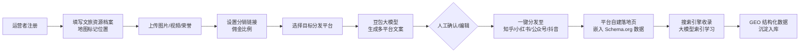
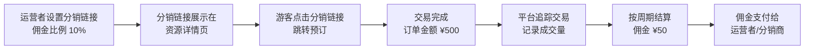
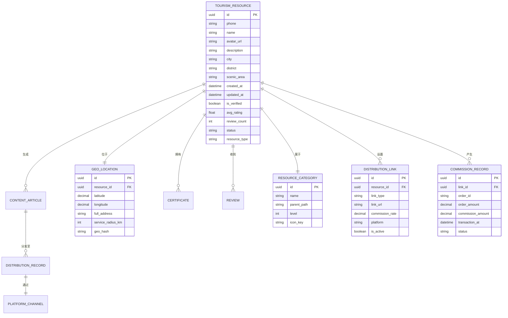

# 产品需求文档（PRD）：文旅 GEO 服务平台

> 文档版本：v1.0  
> 撰写日期：2026-06-17  
> 文档状态：初稿 · 待评审

---

## 1. 产品概述

### 1.1 项目背景与核心洞察

**一句话定义**：一款面向文旅景区、酒店民宿、文创特产、游玩项目运营者的 **GEO（地理位置）文旅信息枢纽**，帮助运营者零门槛入驻，将文旅资源信息生成多平台内容并分发，使其被豆包、DeepSeek 等大模型检索并学习，实现"游客向大模型提问 → 大模型推荐周边文旅资源"的下一代文旅发现模式。

**为什么现在做**：

1. **大模型正在成为新的"旅游决策入口"**：越来越多游客习惯向豆包、DeepSeek、通义千问等大模型直接提问"XX附近有什么好玩的景点"、"XX景区周边有什么推荐的酒店"，而非打开传统旅游平台。但大量优质文旅资源的信息尚未进入大模型的知识体系。

2. **LLMO（大模型优化）是文旅营销的新赛道**：过去景区、酒店需要做 SEO、投广告让用户搜到自己；未来他们需要做 **LLMO（大模型优化）** 让豆包/DeepSeek 能"知道"并推荐自己。目前没有面向文旅运营者的零门槛 LLMO 工具。

3. **文旅营销中间环节多、渠道抽成重**：传统 OTA 平台（携程、美团）抽成高达 15-25%；旅行社、分销商层层加价；游客实际支付的价格远高于商家实际收入。优质文旅资源难以直达游客。

4. **优质小众文旅资源难以被发现**：大量特色景区、精品民宿、特色文创店、独特游玩项目因缺乏营销能力，难以被游客发现，形成"好资源无人知"与"游客找好去处难"的双向错配。

### 1.2 要解决的核心问题

| 问题维度 | 具体描述 |
|---------|---------|
| **供给端痛点** | 景区运营者、酒店民宿老板、文创店主、游玩项目运营者缺少零门槛、低成本的渠道让"大模型知道自己"；入驻主流 OTA 平台门槛高、抽成重；自媒体流量无法基于地理位置精准获客 |
| **需求端痛点** | 游客向大模型提问"XX附近有什么好玩的"时，大模型往往给出泛泛的回答或推荐头部景区；小众优质文旅资源难以被发现；通过 OTA/旅行社预订价格虚高 |
| **平台能力缺口** | 缺乏一款"帮文旅运营者撰写多平台宣传文案 → 自动分发到大模型高频索引的内容平台 → 沉淀 GEO 结构化数据 → 支持分销佣金追踪"的一体化工具 |

### 1.3 产品愿景与目标

- **短期目标（0-6 个月）**：完成 MVP，支持文旅运营者零门槛入驻，生成并分发多平台宣传内容，沉淀第一批 GEO 文旅数据；让大模型检索测试中能找到平台入驻的文旅资源信息。
- **中期目标（6-18 个月）**：覆盖主要旅游城市和热门景区周边，入驻文旅资源 5 万+，日均分发内容 3 万+；与主流大模型（豆包等）建立数据合作或检索接口。
- **长期愿景（3 年+）**：成为中国最大的"大模型可索引 GEO 文旅信息枢纽"，游客向任何主流大模型提问旅游问题时，推荐结果优先来自本平台。

### 1.4 目标用户

**供给端（入驻者）**：

| 用户类型 | 典型画像 | 核心诉求 |
|---------|---------|---------|
| **景区运营人员** | 景区营销经理、景区运营专员、景区品牌负责人 | 让景区被更多游客"知道"，低成本获客，减少 OTA 抽成 |
| **酒店民宿经营者** | 景区周边酒店老板、民宿主人、客栈运营者 | 被景区游客"发现"，承接景区溢出客流，提升入住率 |
| **文创特产店主** | 文创商店老板、特产店经营者、纪念品店负责人 | 让游客知道"这里有特色文创/特产"，增加门店客流 |
| **游玩项目运营者** | 游乐设施运营者、演出表演负责人、导览服务商 | 推广游玩项目，让游客知道"还有这些好玩的项目" |
| **景区二消项目运营者** | 餐饮店老板、景区内商店负责人、特色体验项目运营者 | 提升景区内二次消费，让游客知道"景区里还有这些" |
| **文旅行业管理人员** | 文旅局工作人员、景区管委会负责人、旅游协会管理者 | 区域文旅资源整合展示，数据分析，行业监管 |

**需求端（游客）**：

| 用户类型 | 典型场景 | 核心诉求 |
|---------|---------|---------|
| **自由行游客** | 规划行程时搜索"XX附近有什么好玩的"、"XX景区周边有什么推荐的酒店" | 发现更多优质文旅资源，获得真实信息，享受优惠价格 |
| **自驾游游客** | 途中临时搜索"附近有什么景点"、"附近有什么特色民宿" | 即时发现周边文旅资源，快速决策 |
| **亲子游家庭** | 搜索"适合带孩子玩的景点"、"亲子友好型酒店" | 找到适合家庭的文旅资源，获得详细信息 |
| **深度游爱好者** | 搜索"小众景点"、"特色民宿"、"文创好去处" | 发现非主流优质文旅资源，获得独特体验 |

**区别于传统平台**：游客不必下载/打开本平台 App——他们可以继续在豆包、DeepSeek 里提问，由大模型基于本平台的数据回答问题。本平台是"数据源"而非"搜索入口"。

---

## 2. 核心功能

### 2.1 用户角色

| 角色 | 注册方式 | 核心权限 |
|------|---------|---------|
| **文旅资源运营者（入驻者）** | 手机号 + 实名认证（可选） | 入驻、填写文旅资源信息、上传资料、生成宣传文案、分发内容、设置分销链接、查看数据报表 |
| **文旅行业管理人员** | 平台邀请/认证 | 区域文旅资源管理、数据分析看板、行业监管功能 |
| **内容审核员（平台方）** | 平台内部账号 | 审核内容、处理投诉、管理违规账号 |
| **平台管理员（平台方）** | 平台内部账号 | 配置大模型参数、管理分发渠道、查看全局数据 |
| **游客（信息消费者）** | 无需注册 | 搜索文旅资源、查看详情、通过分销链接预订、评价反馈 |
| **数据消费者（大模型/第三方）** | API 接入授权 | 结构化检索 GEO 文旅数据（需授权） |

### 2.2 功能模块总览

```
┌─────────────────────────────────────────────────────────────────────┐
│                        文旅 GEO 服务平台                              │
├─────────────────────────────────────────────────────────────────────┤
│                                                                     │
│  A. 文旅资源入驻与信息管理模块                                         │
│  ├── A1 零门槛入驻（手机号注册 + 基础资料填写）                         │
│  ├── A2 文旅资源档案创建（资源类型/名称/描述/地理位置/图片/视频）         │
│  ├── A3 资料上传中心（图文/短视频/证书/荣誉/游客评价截图）               │
│  ├── A4 分销链接设置（交易链接/分销链接/佣金比例）                      │
│  └── A5 信息编辑与维护（随时更新资源状态、价格、营业时间）                │
│                                                                     │
│  B. 大模型内容生成模块                                               │
│  ├── B1 智能文案撰写（基于文旅资源档案，自动生成多平台风格宣传文案）       │
│  ├── B2 多平台内容适配（小红书风格/知乎问答/微信公众号/抖音脚本/头条）    │
│  ├── B3 关键词与 GEO 标签注入（自动加入城市/景区/地标/资源类型关键词）    │
│  └── B4 内容预览与人工编辑（AI 生成初稿 → 人工微调 → 确认发布）           │
│                                                                     │
│  C. 多平台内容分发模块                                               │
│  ├── C1 自媒体平台一键分发（知乎/小红书/微信公众号/头条号/抖音）          │
│  ├── C2 "大模型友好"平台优先分发（知乎/博客/技术文档站等大模型高频索引源）│
│  ├── C3 分发状态与效果追踪（是否发布成功/是否被搜索引擎收录/阅读量）       │
│  └── C4 平台自有内容页 SEO 优化（独立落地页 + Schema.org 结构化数据）    │
│                                                                     │
│  D. GEO 结构化数据沉淀模块                                           │
│  ├── D1 文旅资源信息结构化存储（位置/类型/价格/评分/营业时间/联系方式）   │
│  ├── D2 大模型检索接口（标准化 API，供豆包/DeepSeek 等检索）            │
│  ├── D3 数据新鲜度维护（自动提醒更新、标记过期信息）                    │
│  └── D4 区域文旅数字资产（按城市/景区维度的文旅生态数据看板）             │
│                                                                     │
│  E. 游客搜索与发现模块                                               │
│  ├── E1 自然语言检索（游客用口语描述需求 → 大模型理解 → 匹配周边文旅资源）│
│  ├── E2 地图可视化展示（文旅资源在地图上按类型/距离/评分展示）            │
│  ├── E3 文旅资源详情页（完整信息 + 真实评价 + 分销链接）                │
│  └── E4 直联与预订（分销链接跳转、佣金追踪、不介入交易抽成）              │
│                                                                     │
│  F. 分销与佣金追踪模块                                               │
│  ├── F1 分销链接生成（运营者设置交易链接或分销链接）                    │
│  ├── F2 佣金比例设置（运营者自定义佣金比例，吸引分销）                  │
│  ├── F3 交易追踪（通过分销链接产生的成交量追踪）                        │
│  └── F4 佣金结算（按周期结算分销佣金）                                 │
│                                                                     │
│  G. 口碑与信任体系模块                                               │
│  ├── G1 游客评价系统（游玩后的评分与文字评价）                          │
│  ├── G2 认证体系（实名认证/资质认证/官方推荐徽章）                      │
│  ├── G3 投诉与处理（虚假信息举报 + 平台介入仲裁）                       │
│  └── G4 评价真实性验证（多维度防刷 + 关联真实游玩标记）                  │
│                                                                     │
│  H. 文旅行业管理模块                                                 │
│  ├── H1 区域资源管理（文旅局管理辖区内文旅资源）                        │
│  ├── H2 数据分析看板（区域文旅资源分布、热度、供需分析）                 │
│  ├── H3 行业监管（违规资源处理、投诉处理）                              │
│  └── H4 官方推荐（文旅局推荐优质资源，给予官方徽章）                     │
│                                                                     │
└─────────────────────────────────────────────────────────────────────┘
```

### 2.3 文旅资源类型与分类体系

| 一级分类 | 二级分类 | 典型资源示例 | 核心字段 |
|---------|---------|-------------|---------|
| **景区景点** | 自然景区 | 山岳、湖泊、森林、海滩 | 门票价格、开放时间、特色景点、游玩时长建议 |
| | 人文景区 | 古镇、古村落、历史遗迹、博物馆 | 门票价格、开放时间、历史背景、特色展品 |
| | 主题公园 | 游乐园、动物园、植物园、水上乐园 | 门票价格、开放时间、特色项目、适合人群 |
| **酒店民宿** | 星级酒店 | 景区周边星级酒店、度假酒店 | 房价区间、房型、设施、距离景区距离 |
| | 精品民宿 | 特色民宿、客栈、农家乐 | 房价区间、特色、房东介绍、周边环境 |
| | 经济住宿 | 快捷酒店、青年旅舍 | 房价区间、设施、位置便利性 |
| **文创特产** | 文创商店 | 文创产品店、文创市集 | 商品类型、特色产品、价格区间 |
| | 特产店 | 地方特产店、纪念品店 | 特产类型、特色产品、价格区间 |
| | 手工艺品店 | 手工艺品店、非遗体验店 | 工艺类型、体验项目、价格 |
| **游玩项目** | 游乐设施 | 景区内游乐设施、索道、观光车 | 价格、开放时间、适合人群 |
| | 演出表演 | 景区演出、民俗表演、实景演出 | 价格、演出时间、时长 |
| | 导览服务 | 导游服务、讲解服务、定制行程 | 价格、服务内容、时长 |
| | 体验项目 | 亲子体验、户外运动、特色体验 | 价格、体验内容、适合人群 |
| **景区二消项目** | 餐饮美食 | 景区内餐厅、特色小吃、咖啡馆 | 价格区间、特色菜品、营业时间 |
| | 休闲服务 | 景区内茶室、休息区、SPA | 价格、服务内容、营业时间 |
| | 特色体验 | 景区内特色体验项目、拍照服务 | 价格、体验内容 |

### 2.4 页面与功能详细说明

| 页面名称 | 所属模块 | 核心功能描述 |
|---------|---------|---------|
| **Landing / 首页** | A | 展示产品价值主张、入驻入口、搜索入口、热门文旅资源推荐、区域文旅资源展示 |
| **入驻注册页** | A1 | 手机号验证码注册、基础资料引导填写（名称/所在城市/资源类型） |
| **文旅资源档案创建页** | A2 | 地理位置选择（地图选点）、资源类型选择、资源描述填写、价格设置、图片视频上传 |
| **分销链接设置页** | A4 | 设置交易链接（直联预订）、分销链接（分销商推广）、佣金比例设置 |
| **智能文案生成页** | B | 选择目标平台 → AI 自动生成文案 → 人工编辑确认 → 加入 GEO 关键词 |
| **内容分发仪表盘** | C | 已绑定平台列表、一键分发按钮、分发状态追踪、收录状态提示 |
| **文旅资源主页（公开展示页）** | D/E | 资源完整信息展示、图片视频、价格、评价、地图位置、分销链接；Schema.org 结构化数据嵌入 |
| **搜索结果页（地图 + 列表）** | E | 地图上文旅资源分布、列表按距离/评分排序、筛选条件（类型/价格/评分） |
| **运营者管理后台** | A/B/C/D/F/G | 信息维护、内容生成历史、分发数据看板、分销数据、评价管理 |
| **文旅行业管理后台** | H | 区域资源管理、数据分析看板、行业监管、官方推荐 |
| **平台管理后台** | 系统 | 内容审核、投诉处理、大模型 API 配置、数据看板、账号管理 |
| **大模型检索 API 文档页** | D2 | API 接入说明、示例请求/响应、申请接入入口 |

---

## 3. 核心业务流程

### 3.1 文旅运营者入驻与内容分发流程



### 3.2 游客通过大模型发现文旅资源流程

```mermaid
flowchart LR
    A[游客向豆包提问：<br/>"黄山附近有什么<br/>推荐的民宿"] --> B[豆包调用<br/>本平台 GEO 检索 API]
    B --> C[平台检索：<br/>黄山 + 民宿 + 评分≥4.5]
    C --> D[返回结构化结果：<br/>5-10 个匹配民宿信息]
    D --> E[豆包整理为<br/>自然语言回答]
    E --> F[游客获取民宿<br/>名称/位置/分销链接]
    F --> G[游客点击分销链接<br/>预订/下单]
    G --> H[交易完成<br/>佣金追踪]
    H --> I[游客游玩后<br/>扫码评价]
    I --> J[评价数据回流<br/>强化资源可信度]
```

### 3.3 分销佣金流程



---

## 4. 用户界面设计

### 4.1 设计风格

| 设计维度 | 具体说明 |
|---------|---------|
| **设计理念** | 清新、自然、探索感——体现"发现美好去处"的旅游感，同时传递"信息真实可靠"的专业感 |
| **主色调** | 主色：自然绿（#2E7D32）— 代表自然、生态、文旅；辅助色：暖橙（#FF8C00）— 代表活力、优惠、促销；中性色：灰白系列 |
| **按钮风格** | 圆角按钮（border-radius: 12px），微阴影，hover 状态有轻微放大与颜色加深 |
| **字体** | 中文使用"思源黑体"或"苹方"；标题字号 24-32px，正文 14-16px |
| **布局风格** | 卡片式布局为主，地图页面采用"左地图右列表"双栏布局 |
| **图标风格** | 使用线性图标，简洁清晰，文旅主题（山、树、房子、票等） |
| **动画** | 页面切换柔和过渡（300ms）；卡片 hover 有微阴影加深 |

### 4.2 关键页面示意图

**Landing 页**：

```
┌─────────────────────────────────────────────────────────────────┐
│  LOGO [文旅GEO]         入驻入口    搜索文旅     登录           │
├─────────────────────────────────────────────────────────────────┤
│                                                                 │
│           让豆包也能推荐你的文旅资源                              │
│      零门槛入驻 · AI 生成多平台宣传 · 大模型可索引                 │
│                                                                 │
│  ┌─────────────────────────────────────────────────────────┐   │
│  │  描述你的需求，如："黄山附近有什么推荐的民宿"  [搜索]    │   │
│  └─────────────────────────────────────────────────────────┘   │
│                                                                 │
│  [立即入驻 · 免费]   [了解如何被大模型推荐]                       │
│                                                                 │
├─────────────────────────────────────────────────────────────────┤
│                                                                 │
│  热门文旅资源                                                    │
│  ┌─────────┐ ┌─────────┐ ┌─────────┐ ┌─────────┐ ┌─────────┐   │
│  │黄山景区 │ │云海民宿 │ │徽州文创 │ │索道体验 │ │徽菜餐厅 │   │
│  │⭐4.9    │ │⭐4.8    │ │⭐5.0    │ │⭐4.7    │ │⭐4.9    │   │
│  │¥190门票│ │¥280/晚  │ │特色徽雕 │ │¥80/次  │ │人均¥80 │   │
│  └─────────┘ └─────────┘ └─────────┘ └─────────┘ └─────────┘   │
│                                                                 │
├─────────────────────────────────────────────────────────────────┤
│  为什么选择我们？                                                │
│  • 零门槛入驻，不抽成                                            │
│  • AI 帮你写知乎/小红书/公众号文案，一键分发                     │
│  • 让豆包、DeepSeek 等大模型也能"知道"你                         │
│  • 设置分销链接，成交可获得佣金                                  │
│  • 游客直联预订，减少中间环节                                    │
│                                                                 │
└─────────────────────────────────────────────────────────────────┘
```

---

## 5. 数据模型

### 5.1 核心数据模型（ER 图）



### 5.2 关键数据说明

| 数据实体 | 核心字段 | 设计要点 |
|---------|---------|---------|
| **TOURISM_RESOURCE（文旅资源）** | id/手机号/名称/头像/描述/城市/景区/评分/认证状态/资源类型 | 手机号为唯一标识；资源类型区分景区/酒店/文创/游玩项目等 |
| **GEO_LOCATION（地理位置）** | resource_id/经纬度/完整地址/服务半径/GeoHash | GeoHash 索引支持按区域快速检索 |
| **RESOURCE_CATEGORY（资源分类）** | 名称/父级路径/层级/图标Key | 两级分类结构，覆盖景区/酒店/文创/游玩项目/二消项目 |
| **DISTRIBUTION_LINK（分销链接）** | resource_id/链接类型/链接URL/佣金比例/平台 | 支持交易链接和分销链接两种类型 |
| **COMMISSION_RECORD（佣金记录）** | link_id/订单ID/订单金额/佣金金额/交易时间 | 追踪通过分销链接产生的交易和佣金 |

---

## 6. 大模型分发与 LLMO 策略

### 6.1 内容分发优先级

| 优先级 | 平台/渠道 | 理由 |
|-------|----------|------|
| **P0 - 最高** | 知乎（问答+文章） | 大模型训练数据中知乎占比极高；问答格式天然匹配"游客提问"场景 |
| **P0 - 最高** | 平台自建落地页 + Schema.org | 完全可控的结构化数据源；搜索引擎优先索引 |
| **P1 - 高** | 小红书 | 旅游内容核心平台，游客高频使用 |
| **P1 - 高** | 微信公众号 | 旅游攻略核心渠道，私域引流 |
| **P2 - 中** | 抖音 | 视频内容，文旅展示效果好 |
| **P2 - 中** | 头条号 | 资讯平台，曝光量可观 |

### 6.2 AI 文案生成策略

| 目标平台 | 内容策略 | GEO 关键词注入策略 |
|---------|---------|------------------|
| **知乎-问答** | 以"自问自答"形式：问题如"黄山附近有什么推荐的民宿？"，回答由运营者撰写 | 问题标题中必须包含「景区名 + 城市 + 资源类型」 |
| **小红书** | 以"推荐/攻略/探店"风格；emoji 丰富 + 短句 + 高可读 | 标题必须含景区 + 资源类型；末尾标签 `#黄山民宿` `#安徽旅游` 等 |
| **微信公众号** | 长篇旅游攻略/资源介绍 | 标题含景区+资源类型；首段交代位置和特色 |

---

## 7. 商业模式与盈利路径

### 7.1 短期（0-12 个月）：免费 + 增值服务

| 产品 | 面向用户 | 说明 |
|-----|---------|---------|
| 基础入驻 | 所有运营者 | 免费：注册、资源档案、基础文案生成、2个平台分发、分销链接设置 |
| 高级文案套餐（¥19.9/月） | 运营者 | 不限量 AI 文案、全平台分发、GEO 关键词高级优化、收录检测报告 |
| 资质认证（¥99/次） | 运营者 | 平台人工审核资质/荣誉，通过后显示认证徽章 |

### 7.2 中期（12-24 个月）：数据价值变现

| 产品 | 面向用户 | 说明 |
|-----|---------|---------|
| GEO 数据 API 授权 | 大模型厂商/地图厂商 | 按调用量收费或年授权费 |
| 官方推荐位 | 运营者 | 在特定景区/类别的搜索结果中付费提升排名 |
| 佣金分成 | 平台 | 从分销佣金中抽取平台服务费（如 10% 的佣金作为平台收入） |

---

## 8. 里程碑与开发计划

### 8.1 MVP（0-3 个月）

| 阶段 | 目标 | 核心交付 |
|-----|------|---------|
| M1 · 第1个月 | 入驻与数据采集核心打通 | 手机号注册、文旅资源档案创建、地图选点、资料上传、分销链接设置、资源落地页 |
| M2 · 第2个月 | AI 文案生成 + 基础分发 | 对接豆包 API、多平台文案生成、平台自建落地页发布 |
| M3 · 第3个月 | 搜索 + 评价 + 首批用户 | 平台内自然语言搜索、地图展示、资源详情页、评价系统、分销追踪 |

---

## 9. 风险与挑战

| 风险 | 描述 | 应对策略 |
|-----|------|---------|
| **大模型检索效果不达预期** | 文旅资源信息被分发后，大模型实际问答中仍无法精准推荐 | 加强 Schema.org 结构化数据；与豆包/DeepSeek 建立官方数据合作 |
| **冷启动·资源入驻不足** | 初期缺少足够文旅资源，数据稀疏 | 运营团队线下邀请景区、酒店、文创店；与文旅局合作批量入驻 |
| **分销链接追踪准确性** | 第三方平台交易数据难以准确追踪 | 与主要预订平台建立数据对接；使用分销商提供的追踪接口 |

---

> 本文档为 PRD 初稿，欢迎评审反馈。